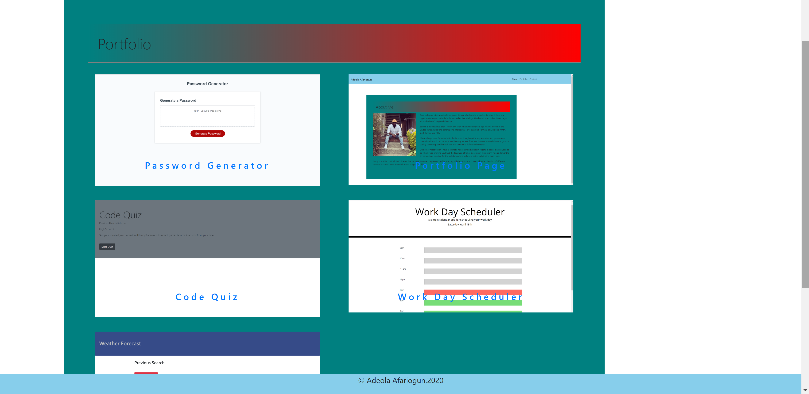

## Author:  Adeola Afariogun

# Project: Portfolio

#### Technology: HTML, CSS, Bootstrap

### Deployment URL: [link to My Portfolio!](https://adeola55.github.io/updated-portfolio/)

This is pretty much an upgrade from homework 02 which i did few weeks ago. its just a portfolio page about myself. it has an about me page, a contact page and a portfolio page. the difference is in the portfolio page is that i replaced the old pictures to pictures of previous projects i have worked on and i also added links to the github and the project itself for users to go through. 

i had fun doing this, it was just a simple task i had to go becuase i have a little more experience than i had when i did the previous task.

## # screenshot of webpage 